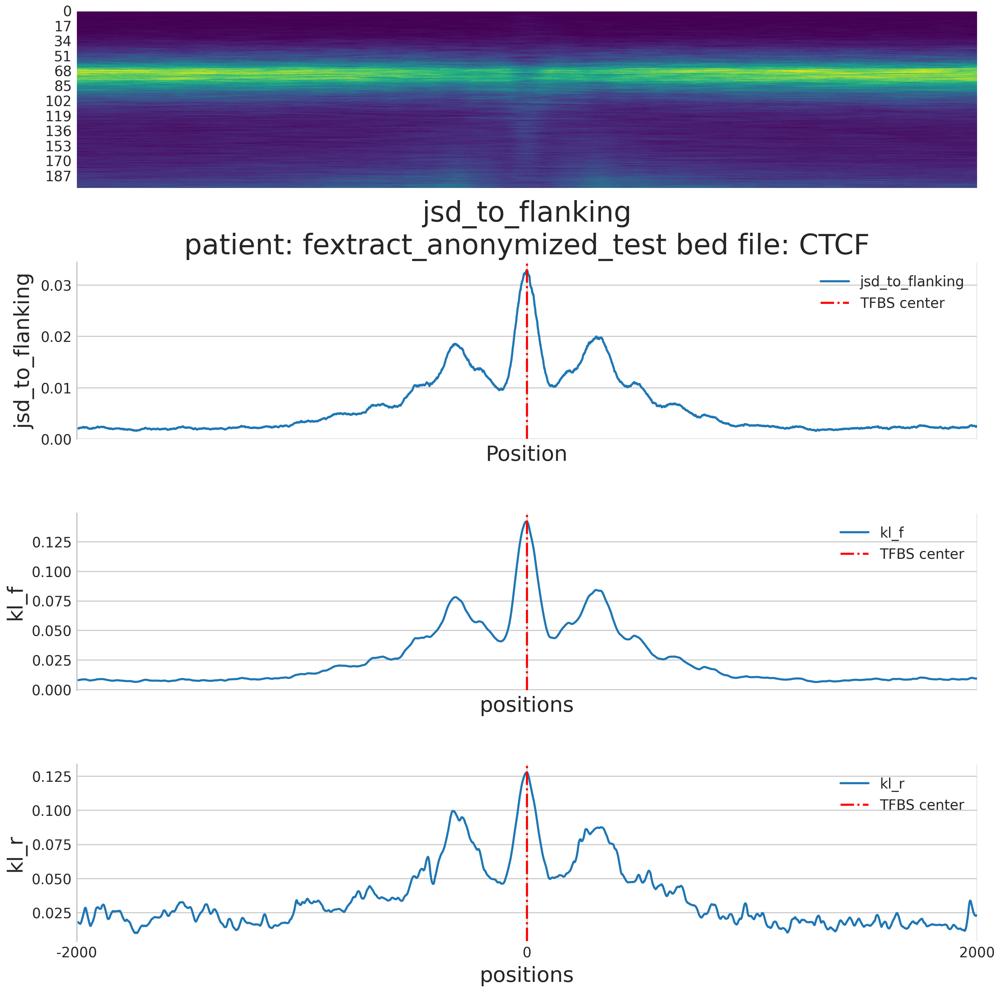

# Fextract JSD to flanking

This is a of [LBFextract](https://github.com/Isy89/LBF) plugin which calculates for all the intervals in a BED file the Jensen-Shannon divergence 
(JSD) between the fragment length distribution in the flanking regions of the interval and the fragment length distribution 
at each position.

It reports the signal as a csvfile and a plot of the signal similar to the following one:

(jsd_to_flanking_ctcf_signal_plot.pdf)


## Signal descriptions

This Plugin  implements the CLI interface for the extract_jsd_to_flanking feature extraction method.

**extract_jsd_to_flanking**

Given a set of genomic intervals having the same length w, extract_jsd_to_flanking calculates the 
JSD at each position, which can be represented as:

$$
\text{JSD}_l(P_l \parallel Q) = \frac{1}{2} \left( \text{KLD}(P_l \parallel M) + \text{KLD}(Q \parallel M) \right)
$$

where \( $ M = \frac{1}{2} (P_l + Q) $\) is the average distribution of \( P \) at position \( l \) and \( Q \), and 
\( $\text{KLD}$ \) is the Kullback–Leibler divergence defined by:

$$
\text{KLD}(P_l \parallel Q) = \sum_{i} P(i) \log \frac{P(i)}{Q(i)}
$$

Where \( l \) represents the genomic position, \( Q \) represents the fragment length distribution in flanking regions 
and \( $P_l$ \) is the fragment length distribution at position \( l \).

## Installation

To install this plugin, you can use the following command:

```bash 
    pip install 'git+https://github.com/Isy89/fextract_jsd_to_flanking.git'
```
